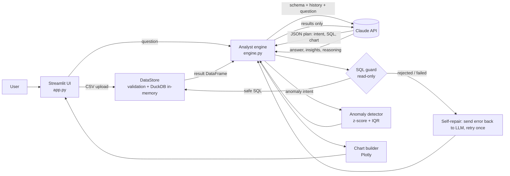

# Architecture

```mermaid
flowchart LR
    U[User] --> UI[Streamlit UI<br/>app.py]
    UI -->|CSV upload| DS[DataStore<br/>validation + DuckDB in-memory]
    UI -->|question| EN[Analyst engine<br/>engine.py]
    EN -->|schema + history + question| LLM[(Claude API)]
    LLM -->|JSON plan: intent, SQL, chart| EN
    EN --> G{SQL guard<br/>read-only}
    G -->|safe SQL| DS
    G -->|rejected / failed| R[Self-repair: send error back to LLM, retry once]
    R --> EN
    EN -->|anomaly intent| AN[Anomaly detector<br/>z-score + IQR]
    DS -->|result DataFrame| EN
    AN --> EN
    EN -->|results only| LLM
    LLM -->|answer, insights, reasoning| EN
    EN --> CH[Chart builder<br/>Plotly]
    CH --> UI
```

**Key idea:** the LLM *plans* and *explains*; DuckDB and pandas *compute*. Every number shown comes from executed code, not from model text.
